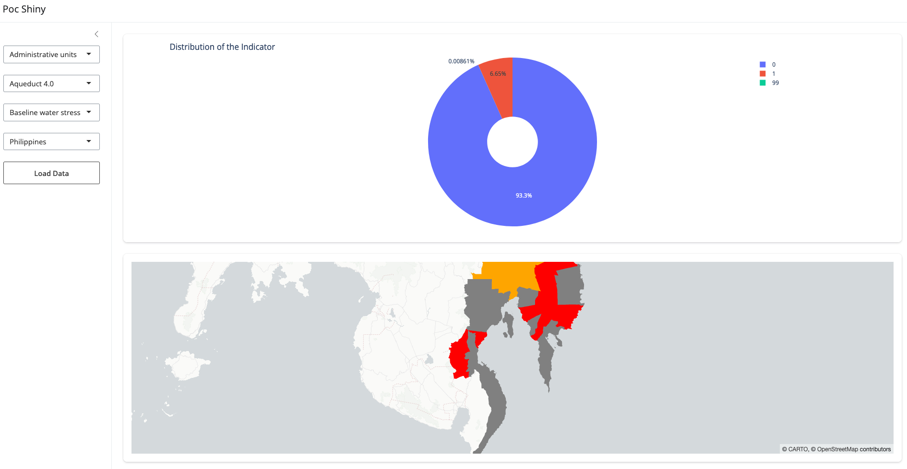

[](https://github.com/AdAstraEco/poc_shiny)


## Objective

This Proof of Concept demonstrates the feasibility of creating a dynamic dashboard and interactive map using data from a Parquet file stored in a Google Cloud Storage bucket.



Note: The code may not be elegant, but it functions effectively with Parquet files hosted in a cloud bucket. These Parquet files are very large, so the code is designed to query the files remotely, retrieving only the relevant information to optimize performance.

## Installation Instructions

1. **Set Environment Variables**: 
   - Use `.template_env` as a reference template and rename it to `.env`, or add the necessary variables directly into the Dockerfile.

2. **Build the Docker Image**:
   - Ensure the Dockerfile and environment variables are configured correctly.

3. **Run the Container**:
   ```bash
   docker run -p 8000:80 shiny-express-app
   ```


This will launch the app. A dropdown menu will appear on the left side of the interface, with a basic plot and map displayed in the main section.


## Next Steps

1.  Deploy the App in Production: Host the application on our infrastructure, optimizing resource allocation to minimize costs.
1. Implement Security: Although the current data isn’t sensitive, consider adding an access control layer to manage user accreditation. Determine the best approach to integrate this layer efficiently.
1. Consider creating a service account with access restricted to only the relevant bucket.


